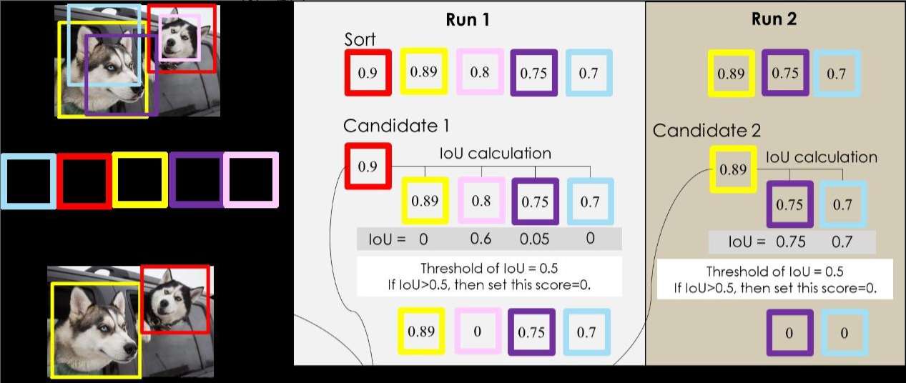
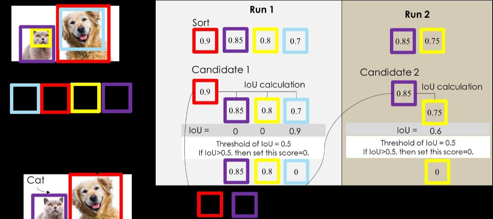

# 非极大值抑制

Non-Maximum Suppression（NMS）非极大值抑制。从字面意思理解，抑制那些非极大值的元素，保留
极大值元素。其主要用于目标检测，目标跟踪，3D重建，数据挖掘等。  

而在目标检测的领域中，由于单一物体会存在多个重复识别框，为了避免单一物体出现多个识别框，此时
我们需要引入NMS算法进行过滤，实现将最高置信度的物体识别框进行输出。从而确保最终我们的输出
符合我们预期的效果要求。  

## 1. 传统算法逻辑

### 单一分类逻辑



1.「确定是物体集合」= {空集合}  
2. Run 1: 先将BBox依照置信度排序，置信度最高的BBox (红色) 会被选入「确定是物体集合」內，其他BBox会根据这步骤选出最高的BBox进行IoU计算，如果粉红色的IoU为0.6大于我们设定的0.5，所以将粉红色的BBox置信度设置为0。
此时「确定是物件集合」= {红色BBox }  
3. Run 2: 不考虑置信度为0和已经在「确定是物体集合」的BBox，剩下來的物体继续选出最大置信度的BBox，将此BBox(黄色)丟入「确定是物体集合」，剩下的BBox和Run2选出的最大置信度的BBox计算IoU，其他BBox都大于0.5，所以其他的BBox置信度設置为0。
此时「确定是物件集合」= {红色BBox; 黄色BBox}  
4. 因为沒有物体置信度>0，所以结束NMS。
「确定是物件集合」= {红色BBox; 黄色BBox}。

### 使用方式

除了我们自己编写对应的实现代码以外，我们还可以直接使用`torchvision`的实现。  

```python
torchvision.ops.nms(boxes, scores, iou_threshold)
```

### 多分类逻辑



前面的范例一是标准的NMS程序，这边要搭配一下分类来看，范例二和标准NMS做法一样，先将「确定是物件集合」选出来，此例是NMS选出的BBox是{紫色BBox ; 红色BBox}。

这时候再搭配一下分类的机率，就可以把每个NMS选出的BBox做类别判断了如上图，每个BBox都会带有一组机率

### 使用方式

相较于单一分类，针对多分类最简单的方式就是针对每个类别进行单独的计算即可，具体的使用也可以通过`torchvision`实现来进行实现。  

```python
torchvision.ops.boxes.batched_nms(boxes, scores, classes, nms_thresh)
```

在yolov5中针对多分类的NMS只采用了torchvision的单一分类，其多分类采用了自行编写的方式进行判断，具体如下。  

```python
c = x[:, 5:6] * (0 if agnostic else max_wh)  # classes
boxes, scores = x[:, :4] + c, x[:, 4]  # boxes (offset by class), scores
i = torchvision.ops.nms(boxes, scores, iou_thres) 
```

## 2. Soft-NMS

### 概述

对于IOU≥NMS阈值的相邻框，传统NMS的做法是将其得分暴力置0，相当于被舍弃掉了，这就有可能造成边框的漏检，尤其是有遮挡的场景。
Soft-NMS对IOU大于阈值的边框，Soft-NMS采取得分惩罚机制，降低该边框的得分，即使用一个与IoU正相关的惩罚函数对得分进行惩罚。
「当邻居检测框b与当前框M有大的IoU时，它更应该被抑制，因此分数更低。而远处的框不受影响。」  

其主要分为两种类型的，既线性衰减型，即不连续，会发生跳变，导致检测结果产生较大的波动与指数高斯型，更为稳定、连续、光滑。

### 局限性

1. 仍采用循环遍历处理模式，而且它的运算效率比Traditional NMS更低。
2. 对双阶段算法友好，但在一些单阶段算法上可能失效。（所以看soft-NMS论文时会发现它只在two-stage模型上比较，可能是因为one-
stage模型在16年才提出来，之后才开始大火）soft-NMS也是一种贪心算法，并不能保证找到全局最优的检测框分数重置。
3. 遮挡情况下，如果存在location与分类置信度不一致的情况，则可能导致location好而分类置信度低的框比location差分类置信度高的框惩罚更多
4. 评判指标是IoU，即只考虑两个框的重叠面积，这对描述box重叠关系或许不够全面

### 使用方式

本文档提供了基于Pytorch的版本，其也可以支持CUDA加速来利用除了CPU运算的以外的GPU进行运算的方式，具体实现的代码可以
参考[本文章](/cnn/nms/softNMS.py)，该函数包含了上述两种类型的权重计算方式，默认是采用了传统的NMS的计算方式进行计算。  

主要希望能够支持多个分类的目标的识别判断，可以采用其中的``

## 3. Weighted-NMS

### 概述

W-NMS认为Traditional NMS每次迭代所选出的最大得分框未必是精确定位的，冗余框也有可能是定位良好的。因此，W-NMS通过分类置信度与IOU来对
同类物体所有的边框坐标进行加权平均，并归一化。其中，加权平均的对象包括M自身以及IoU≥NMS阈值的相邻框。
相关的论文可以[参考此](https://openaccess.thecvf.com/content_ICCV_2017_workshops/papers/w14/Zhou_CAD_Scale_Invariant_ICCV_2017_paper.pdf)

### 局限性

1. 通常能够获得更高的Precision和Recall，一般来说，只要NMS阈值选取得当，Weighted NMS均能稳定提高AP与AR；  
2. 仍为顺序处理模式，且运算效率比Traditional NMS更低；  
3. 加权因子是IOU与得分，前者只考虑两个框的重叠面积；而后者受到定位与得分不一致问题的限制； 

### 使用方式

这里借鉴参考了`ZFTurbo`的关于`Weighted boxes fusion`的代码，具体可以参考[本项目](https://github.com/OrvilleX/MachineLearning/tree/master/cnn)，
同时本文也可以需要的部分截取了其中的部分[代码](/cnn/nms/weightedNMS.py)，如果需要像使用类库一样去使用其提供各类的函数可以采用下述方式进行操作。  

```bash
pip install ensemble-boxes
```

## 4. IOU-Guided NMS

### 概述

一个预测框与真实框IOU的预测分支来学习定位置信度，进而使用定位置信度来引导NMS的学习。具体来说，就是使用定位
置信度作为NMS的筛选依据，每次迭代挑选出最大定位置信度的框M，然后将IOU≥NMS阈值的相邻框剔除，但把冗余框及其
自身的最大分类得分直接赋予M。因此，最终输出的框必定是同时具有最大分类得分与最大定位置信度的框。

### 局限性

1. 通过该预测分支`解决了NMS过程中分类置信度与定位置信度之间的不一致`，可以与当前的物体检测框架一起端到端地
训练，在几乎不影响前向速度的前提下，有效提升了物体检测的精度;  
2. 有助于提高严格指标下的精度，在IOU阈值较高时该算法的优势还是比较明显的（比如AP90），原因就在于IOU阈值较高
时需要预测框的坐标更加准确才能有较高的AP值；  
3. 顺序处理的模式，运算效率与Traditional NMS相同；  
4. 需要额外添加IoU预测分支，造成计算开销；  
5. 评判标准为IOU，即只考虑两个框的重叠面积；  

## 5. Softer-NMS

### 概述

其极大值的选择/设定采用了与类似Weighted NMS（加权平均）的方差加权平均操作，其加权的方式采用了类似soft NMS的
评分惩罚机制（受Soft-NMS启发，离得越近，不确定性越低，会分配更高的权重），最后，它的网络构建思路与IOU-Guided NMS相类似。

### 局限性

1. 增加了定位置信度的预测，是定位回归更加准确与合理;  
2. 使用便捷，可以与Traditional NMS或Soft-NMS结合使用，得到更高的AP与AR;  
3. 顺序处理模式，且运算效率比Traditional NMS更低;  
4. 额外增加了定位置信度预测的支路来预测定位方差，造成计算开销;  
5. 评判标准是IoU，即只考虑两个框的重叠面积，这对描述box重叠关系或许不够全面;  

### 使用方式

主要参考了[KL-Loss](https://github.com/yihui-he/KL-Loss/tree/master)中关于Softer-NMS的部分实现代码并提取
经过简单的改动后再本项目[此文件](/cnn/nms/softerNMS.py)。  

## 6. Adaptive-NMS

### 概述

Adaptive NMS应用了动态抑制策略，通过设计计了一个Density-subnet网络预测目标周边的密集和稀疏的程度，引入密度监督信息，使阈值随着目标周边的密稀程度而对应呈现上升或衰减。当邻框远
离M时，保持si不变；对于远离M的检测框，它们被误报的可能性较小，因此应该保留它们。对于高度重叠的相邻检测，抑制策略不仅取决于与M的重叠，还取决于M是否位于拥挤区域。当M处于密集区域时
（即Nm>Nt），目标密度dM作为NMS的抑制阈值；若M处于密集区域，其高度重叠的相邻框很可能是另一目标的真正框，因此，应该分配较轻的惩罚或保留。当M处于稀疏区域时（即Nm≤Nt），初始阈值Nt作
为NMS的抑制阈值。若M处于稀疏区域，惩罚应该更高以修剪误报。

### 局限性

1. 可以与前面所述的各种NMS结合使用;  
2. 对遮挡案例更加友好;  
3. 双阶段和单阶段的检测器都有效果;  
4. 与Soft-NMS结合使用，效果可能倒退 (受低分检测框的影响);  
5. 顺序处理模式，运算效率低;  
6. 需要额外添加密度预测模块，造成计算开销;  
7. 评判标准是IoU，即只考虑两个框的重叠面积，这对描述box重叠关系或许不够全面;  

### 使用方式

ANMS目前可通过参考[本文档](https://github.com/BAILOOL/ANMS-Codes)对应的python实现部分。  

## 7. Weighted boxes fusion（加权框融合）

### 概述

目标检测模型常采用NMS和Soft-NMS，这种方式对于单个模型的预测结果有效，但本质上都是从模型的预测框中筛选最终的结果，过滤掉其他重合框。 
如果多个模型做集成学习，NMS和Soft-NMS是通过删除部分预测框得到预测结果，不能充分利用所有的框的信息，而WBF利用所有检测框的置信度来
构造最终的预测框，可以获得更准确的预测结果。  

相关的论文可以参考[此文档](https://arxiv.org/abs/1910.13302)

### 使用方式

其本身与W-NMS类似，直接可以使用安装库进行使用，也可以通过本项目中的[代码](/cnn/nms/wbf.py)来进行学习了解。  

```bash
pip install ensemble-boxes
```

# 参考文档
1. [详解目标检测NMS算法发展历程](https://zhuanlan.zhihu.com/p/623726684)  
2. [ZFTurbo的参考源码](https://github.com/ZFTurbo/Weighted-Boxes-Fusion)  
3. [KL-Loss](https://github.com/yihui-he/KL-Loss)  
4. [ANMS-Codes](https://github.com/BAILOOL/ANMS-Codes)  
5. [加权框融合WBF介绍](https://blog.csdn.net/Yemiekai/article/details/117839686)  