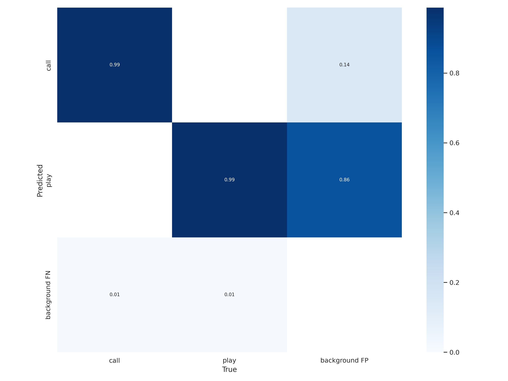
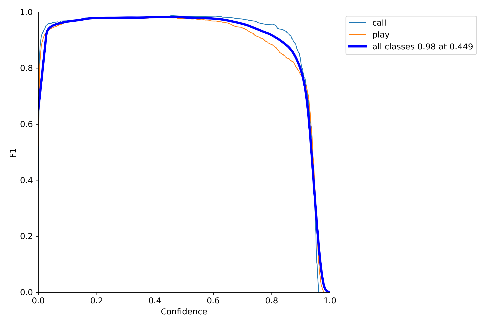
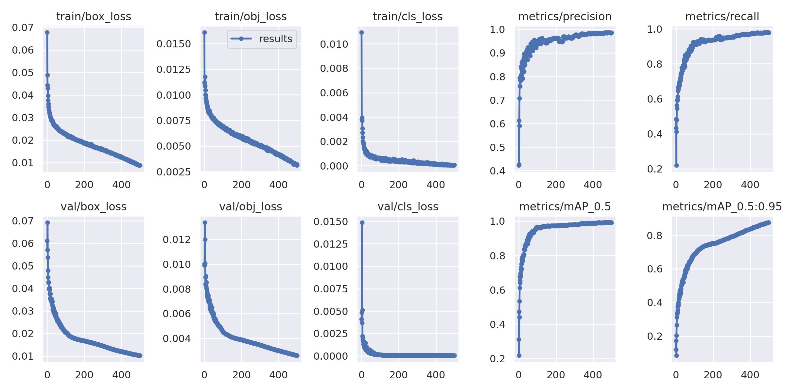

## 一、评估方式

### 1. 混淆矩阵(confusion_matrix)

混淆矩阵是对分类问题预测结果的总结。使用计数值汇总正确和不正确预测的数量，并按每个类进行细分，显示了分类模型进行预测时会
对哪一部分产生混淆。通过这个矩阵可以方便地看出机器是否将两个不同的类混淆了（把一个类错认成了另一个）。混淆矩阵不仅可以让
我们直观的了解分类模型所犯的错误，更重要的是可以了解哪些错误类型正在发生，正是这种对结果的分解克服了仅使用分类准确率带来
的局限性（总体到细分）。



比如上图中的Y轴代表预测类别，X轴代表真实类别，从上图中可以看到call与play均存在0.01%比列的目标存在漏报。并且其中玩手机存在大量不存在该行为的目标被识别为存在该行为的现象。

### 2. F1分数（F1_curve）
F1分数与置信度之间的关系。F1分数（F1-score）是分类问题的一个衡量指标，是精确率precision和召回率recall的调和平均数，最大为1，最小为0, 1是最好，0是最差。



### 3. 标注统计数据（labels）

* 图1：训练集得数据量，每个类别有多少个；
* 图2：框的尺寸和数量；
* 图3：中心点相对于整幅图的位置；
* 图4：图中目标相对于整幅图的高宽比例；


### 4. 体现中心点横纵坐标以及框的高宽间的关系(labels_correlogram)

表示中心点坐标x和y，以及框的高宽间的关系。每一行的最后一幅图代表的是x，y，宽和高的分布情况，对应关键图的说明如下：

* 图（0，0）：表明中心点横坐标x的分布情况，可以看到大部分集中在整幅图的中心位置；
* 图（1，1）：图表明中心点纵坐标y的分布情况，可以看到大部分集中在整幅图的中心位置；
* 图（2，2）：图表明框的宽的分布情况，可以看到大部分框的宽的大小大概是整幅图的宽的一半；
* 图（3，3）：图表明框的宽的分布情况，可以看到大部分框的高的大小超过整幅图的高的一半


### 5. 单一类准确率(P_curve)
准确率曲线图，当判定概率超过置信度阈值时，各个类别识别的准确率。当置信度越大时，类别检测越准确，但是这样就有可能漏掉一些判定概率较低的真实样本。

### 6. 单一类召回率（R_curve）
召回率曲线图，当置信度越小的时候，类别检测的越全面（不容易被漏掉，但容易误判）。

### 7. 精确率和召回率的关系图（PR_curve）
R曲线体现精确率和召回率的关系。mAP 是 Mean Average Precision 的缩写，即 均值平均精度。可以看到：精度越高，召回率越低。我们希望：在准确率很高的前提下，尽可能的检测到全部的类别。因此希望我们的曲线接近(1,1)，即希望mAP曲线的面积尽可能接近1。

### 8. 结果Loss（results）
* Box_loss：YOLO V5使用 GIOU Loss作为bounding box的损失，Box推测为GIoU损失函数均值，越小方框越准；
* Objectness_loss：推测为目标检测loss均值，越小目标检测越准；
* Classification_loss：推测为分类loss均值，越小分类越准；
* Precision：精度（找对的正类/所有找到的正类）；
* Recall：真实为positive的准确率，即正样本有多少被找出来了（召回了多少）.Recall从真实结果角度出发，描述了测试集中的真实正例有多少被二分类器挑选了出来，即真实的正例有多少被该二分类器召回。



## 二、基础知识

### 1.相关配置

首先我们通过打开对应模型的配置文件，如`yolov5s.yaml`文件，我们可以针对其中的参数进行分析，首先是关键的参数。即针对网络
模型的宽度以及程度的控制参数，本质上yolo模型的网络构成是一致的，其主要是对应的深度以及宽度的差异导致模型的复杂度的差异性。

`depth_multiple`: 模型层数因子(用来调整网络的深度),再后续的backbone以及head中会有网络的数量，该数量将会与这里的因子关联，从而
导致具体的网络的深度存在差异性;  
`width_multiple`: 模型通道数因子(用来调整网络的宽度),用于控制backbone以及head模型的输出通道数，从而影响特征图的宽度，从而导致其
可携带的信息减少;

不同的网络主要是依据上面2个核心参数决定其复杂度以及准确度,主要为`yolov5n`、`yolov5s`、`yolov5m`与`yolov5l`等。

### 2.锚框Anchors
通过`yolov5s.yaml`可以观察到默认的Anchors，主要有三个不同层数的特征。
```yaml
anchors:
  - [10,13, 16,30, 33,23]  # P3/8
  - [30,61, 62,45, 59,119]  # P4/16
  - [116,90, 156,198, 373,326]  # P5/32
```

其代后面的注释代表P3为层数，/后面的数字为下采样率，8代表按照原图1/8缩放。其默认初始化了9个anchors，分别在三个特征图（feature map）
中使用，每个feature map的每个grid cell都有三个anchor进行预测。分配规则：
* 尺度越大的 feature map 越靠前，相对原图的下采样率越小，感受野越小， 所以相对可以预测一些尺度比较小的物体(小目标)，分配到的 anchors 越小。
* 尺度越小的 feature map 越靠后，相对原图的下采样率越大，感受野越大， 所以可以预测一些尺度比较大的物体(大目标)，所以分配到的 anchors 越大。

针对其中所提及的特征图的含义可以通过[通道与特征图](https://www.cnblogs.com/lfri/p/10491009.html)学习了解，进一步完善相关基础知识。  

### 3.网络构成
通过`yolov5s.yaml`可以发现其通过配置实现网络模型的构成，为此我们需要了解其中所代表的含义，下面截取backbone部分的配置项进行介绍
从来更好的了解其配置的含义以及对模型的影响。
```yaml
backbone:
  # [from, number, module, args]
  [[-1, 1, Conv, [64, 6, 2, 2]],  # 0-P1/2
   [-1, 1, Conv, [128, 3, 2]],  # 1-P2/4
   [-1, 3, C3, [128]],
   [-1, 1, Conv, [256, 3, 2]],  # 3-P3/8
   [-1, 6, C3, [256]],
   [-1, 1, Conv, [512, 3, 2]],  # 5-P4/16
   [-1, 9, C3, [512]],
   [-1, 1, Conv, [1024, 3, 2]],  # 7-P5/32
   [-1, 3, C3, [1024]],
   [-1, 1, SPPF, [1024, 5]],  # 9
```

上述的结构按照顺序主要代表的含义如下：
* from: 代表输入从哪一层获取，-1代表上一层，也可以多层获取，如[-1,6]代表从上一层以及第6层获得;
* number: 表示有几个相同的模块，对应就是层的深度，其depth_multiple会影响实际的层数;
* module: 模块的名称，主要集中于common.py中;
* args: 类的初始化参数，用于解析作为moudle的传入参数;

举例我们有这么一个模块对应的参数如何对照到其中并影响，比如模块的入参要求如下。
```python
class Conv(nn.Module):
    # Standard convolution
    def __init__(self, c1, c2, k=1, s=1, p=None, g=1, act=True):  # ch_in, ch_out, kernel, stride, padding, groups
        """
        @Pargm c1: 输入通道数
        @Pargm c2: 输出通道数
        @Pargm k : 卷积核大小(kernel_size)
        @Pargm s : 卷积步长 (stride)
        @Pargm p : 特征图填充宽度 (padding)
        @Pargm g : 控制分组，必须整除输入的通道数(保证输入的通道能被正确分组)
        """
        pass
```

如`width_multiple`设置为0.5，该模块在yaml中的参数为`[64, 6, 2, 2]`首先输入通道数是由上层决定所以默认会在此参数前追加，对应的64代表
输出的通道数，但是实际输出的通道数是64*0.5=32通道数，从而控制了通道数，即宽度。

而`depth_multiple`则是与模块的数量进行计算，其计算的代码如` n = n_ = max(round(n * gd), 1) if n > 1 else n`比如某个
模块设置的数量是4，对应的深度为0.5那么通过上述的公式最终实际的数量就为2了。

## 二、经验集合

### 1. 数据集标准
* 每个类的图像: >= 1500 张图片。
* 每个类的实例: ≥ 建议每个类10000个实例（标记对象）
* 图片形象多样: 必须代表已部署的环境。对于现实世界的使用案例，我们推荐来自一天中不同时间、不同季节、不同天气、不同照明、不同角度、不同来源（在线采集、本地采集、不同摄像机）等的图像。
* 标签一致性: 必须标记所有图像中所有类的所有实例。部分标记将不起作用。
* 标签准确性: 标签必须紧密地包围每个对象。对象与其边界框之间不应存在任何空间。任何对象都不应缺少标签。
* 标签验证: 查看train_batch*.jpg 在 训练开始验证标签是否正确，即参见 mosaic （在 yolov5 的训练日志 runs/train/exp* 文件夹里面可以看到）。
* 背景图像: 背景图像是没有添加到数据集以减少 False Positives（FP）的对象的图像。我们建议使用大约0-10%的背景图像来帮助减少FPs（COCO有1000个背景图像供参考，占总数的1%）。背景图像不需要标签。

### 参考文献
* [YOLOv5全面解析教程（一）：网络结构逐行代码解析](https://blog.csdn.net/limingmin2020/article/details/127800582?spm=1001.2014.3001.5502)
* [YOLOv5全面解析教程（二）：YOLOv5数据集结构解析](https://blog.csdn.net/limingmin2020/article/details/127959310?spm=1001.2014.3001.5502)