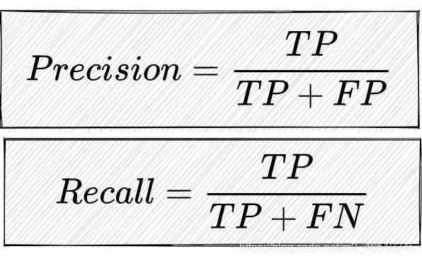
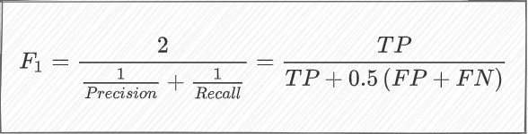
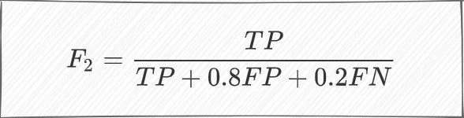

# 输入图像尺寸对训练的影响

## 关于Yolov5网络特点
YoloV5的整个⽹络CNN的层由3*3的卷积核进⾏卷积操作。在Backbone的最后阶段，会有⼀个ASPP结 构，它通过空洞卷积在Backbone最后阶段进⾏不同感受野的特征提取，之后送⼊Neck。

### 感受野对全局信息的影响

YoloV5的Baseline并没有采⽤位置感知的可变形卷积，它每个卷积层采⽤了固定感受野的3*3卷积和空洞卷积，相对地，模型在提取特征时，它的感受野就相对固定了。同样的图⽚，如果我们把它的尺⼨缩放⾄⽐640*640更⼤的尺⼨进⾏训练，那么模型的获取的全局信息就相对下降。这就有⼀点盲⼈摸象的即视感了。

### 感受野对局部信息的影响

从另外⼀个⻆度来看，如果你的图像上有⼩物体，它位于640*640中被32倍的stride浓缩后，它的位置信息可能消失于feature中了，只留给了feature抽象信息。如果我们把它的尺⼨缩放⾄⽐640*640更⼤的尺⼨进⾏训练，那么模型在多次的stride后依然就感知到它的位置信息，这对于定位任务来说是带来了帮助的。就正如，我们可以⽤放⼤镜去关注了⼀些⼩物体的信息。

## 关于衡量标准

### 关键的概念

* 正确率: 模型预测出来的样本，正确数量的⽐例，即预测正确的数量与预测的总数量的⽐值。
* 召回率：模型预测出来的样本，有多少事先标记为有⽬标的样本数量被找出来了，即预测正确的数量与事先标记为有⽬标的样本数量的⽐值。

对于这两者概率，如果模型尽可能地预测更多的样本，那么它命中事先标记为有⽬标的样本的⼏率就⽐较⼤，此时，召回率就会⽐较⾼。但与此同时，由于⽣成了更多的预测样本，⽽事先标记为有⽬标的样本总数⼜是恒定不变时，于是此时的正确率就会下降。

关于这连个关键指标的计算，就需要引入其他的专业术语，便于进行公式计算。
* TP（真阳性样本）: 模型识别的锚框与标注框位置以及数量符合的数量；
* FP（假阳性样本）：模型识别的锚框与标注不符且也不存在理应被识别到的数量；
* FN（假阴性样本）：模型未能识别到锚框的目标，从而产生的漏检的数量；

通过上述几个指标所计算的正确率以及召回率公式。

### F1&F2指标

单靠正确率以及召回率并不能很好的反应模型的实际识别效果，为此我们需要引入其他更科学的
指标来对模型的整体识别效果进行评估，首先在Yolov5中默认具备的是F1指标。F1指标权衡了正确率和召回率。假设正确率和召回率之和的值相对稳定，正确率和召回率任⼀个值偏⼩时，整体得到的F1分数会变得偏⼩，只有两者尽可能接近时才能得到⽐较可观的F1分数。

FP对分⺟的贡献⽐FN⼤，这意味着，增加相同的FP值和FN值时，同样的FP值计算出来的F2 分数⽐同样的FN值计算出来的F2分数⼤。这就意味着，可以瞎猜，猜错⽐猜不出来得到的F2分数⼤。

## 参考链接

[目标检测比如 yolov5，训练输入图像大小默认是 640*640，这个是不是越大训练的效果越好](https://www.zhihu.com/question/471087763/answer/2328245325?utm_id=0)