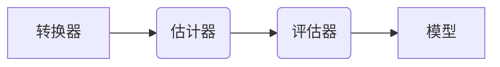

# Spark MLib

在Spark下进行机器学习，必然无法离开其提供的MLlib框架，所以接下来我们将以本框架为基础进行实际的讲解。首先我们需要了解其中最基本的结构类型，即转换器、估计器、评估器和流水线。  



# 一、基础使用  

接下来我们将以一个简单的例子为基础整体介绍在Spark下进行机器学习的使用方式，便于读者大体熟悉完整的流程节点。当然在这其中对于部分不了解的情况下可以等在后续详细学习的过程中进行补充即可。

> [点击此处查看代码示例](src/main/scala/MachineLearnWithSpark.scala)  

## 1. 特征工程  

这部分相关知识可以参考本人编写的[人工智能专题]()的开源教程，其中对该部分进行详细的说明，下面我们将就框架提供的`RFormula`进行具体的实战操作（这里熟悉R语言的可能对此比较熟悉，本身就是借鉴了R语言，但是仅实现了其中的一个子集），对于我们需要进行特征化的数据首先我们需要定义对应的线性模型公式，具体如下。  

```java
Dataset<Row> df = session.read().json("sparkdemo/data/simple-ml");
RFormula supervised = new RFormula().setFormula("lab ~ . + color: value1 + color: value2");
```

当然仅仅通过上述的方式还不能实现对数据的特征化，我们还需要通过数据对其进行训练，从而得到我们所需的转换器，为此我们需要使用其中的`fit`方法进行转换。  

```java
RFormulaModel model = supervised.fit(df);
```  

完成转换器的训练后我们就可以利用其进行实际的转换操作，从而生成特征`features`与标签`label`列，当然读者也可以通过`supervised.setLabelCol`设置标签列名，`supervised.setFeaturesCol`设置特征列名。对于监督学习都需要将数据分为样本数据与测试数据，为此我们需要通过以下方式将数据拆分。  

```java
Dataset<Row>[] data = preparedDF.randomSplit(new double[]{0.7, 0.3});
```  

## 2. 模型训练  

在Spark MLib中为估计器，这里我们将采用逻辑回归的算法做为演示，提供一个分类算法模型的训练，首先我们实例化我们需要的模型类，通过其提供的方式对将训练数据传入其中进行模型的训练。  

```java
LogisticRegression lr = new LogisticRegression();
LogisticRegressionModel lrModel = lr.fit(data[0]);
lrModel.transform(data[1]).select("label1", "prediction").show();
```  

如果在对数据进行特征工程的时候将标签以及特征列的名称进行了修改，那么我们也需要通过`lr.setLabelCol`以及`lr.setFeaturesCol`进行同步修改调整。同时框架也提供了`explainParams`方法打印模型中可供调整的参数。  

## 3. 流水线  

对于机器学习，后期工作基本就是对各种参数的调优，为此Spark提供了友好的流水线，并基于其本平台分布式计算集群的能力助力我们缩短对不同参数模型的训练与评估，从而提供最佳的参数模型供我们使用，下面我们将一步一步介绍如何使用其提供的该特性。首先我们定义工作流中涉及到的阶段步骤，具体如下所示。  

```java
Dataset<Row> df = session.read().json("sparkdemo/data/simple-ml.json");
Dataset<Row>[] data = df.randomSplit(new double[] {0.7, 0.3});

RFormula rForm = new RFormula();
LogisticRegression lr = new LogisticRegression();
Pipeline pipeline = new Pipeline().setStages(new PipelineStage[] { rForm, lr });
```  

上述完成工作流水线各阶段的任务后，接下来我们就需要指定各阶段的参数列表，从而便于Spark形成不同的组合进行模型训练。  

```java
Seq<String> formulaParam = JavaConverters.asScalaIteratorConverter(Arrays.asList("lab ~ . + color:value1", "lab ~ . + color:value1 + color:value2").iterator()).asScala().toSeq();

ParamMap[] params = new ParamGridBuilder()
    .addGrid(rForm.formula(), formulaParam)
    .addGrid(lr.elasticNetParam(), new double[]{0.0, 0.5, 1.0})
    .addGrid(lr.regParam(), new double[]{0.1, 2.0})
    .build();
```  

有了以上其实我们就可以单纯的进行模型训练了，但是这样训练除的模型并无法评估出最好的一个模型。我们需要指定一个评估器用来评估实际效果是否符合最佳。这里我们主要采用了`BinaryClassificationEvaluator`类。  

```java
BinaryClassificationEvaluator evaluator = new BinaryClassificationEvaluator()
    .setMetricName("areaUnderROC")
    .setRawPredictionCol("prediction")
    .setLabelCol("label");
```  

最后我们需要能够自动调整超参数，并自动分配数据集的方式将上述的各部分组成从而形成最终有效的模型。  

```java
TrainValidationSplit tvs = new TrainValidationSplit()
    .setTrainRatio(0.75)
    .setEstimatorParamMaps(params)
    .setEstimator(pipeline)
    .setEvaluator(evaluator);
```  

而具体的使用与之前逻辑回归的方式如出一辙。  

```java
TrainValidationSplitModel model = tvs.fit(data[0]);
System.out.println(evaluator.evaluate(model.transform(data[1])));
```  

如果读者需要将该模型进行持久化可以采用`model.write().overwrite().save("sparkdemo/data/model");`该方式进行实际的持久化，当然读取时需要采用与写入一致的类，否则将无法正确读取。  

# 二、特征工程  

参考[机器学习教程](../ReadMe.md)中对应章节的内容可弥补关于各类算法的基础知识，接下来我们将仅从基于Spark的实战角度出发进行列举常用的方式对特定的数据预处理。  

## 1. 通用  

下面我们将介绍较通用的三种的针对数据进行处理的方式，其中一种上述的教程已经使用了，这里将仅做为介绍进行概述。

> [点击此处查看代码示例](src/main/scala/FeatureEngineering.scala)  

### 1) RFormula  

其主要参考了基于R语言的formula设计思路，当然其中仅仅支持有限有限的操作符。并且其中对于字符串的处理是采用独热编码（One-hot）的方式，具体的使用方式如下。  

```scala
val supervised = new RFormula().setFormula("lab ~ . + color:value1 + color:value2")
supervised.fit(df).transform(df).show()
```  

支持的操作符如下：  
> `~ 分割标签与特征`  
> `+ 将两个特征相加，+ 0代表除去截距`  
> `- 减去一个特征， - 1代表除去截距`  
> `: 将多个特征相乘变成一个特征`  
> `. 选取所有特征` 

如果读者不了解其中表达式的作用，接下来我们将举一个例子，假设a,b为2个特征，y是应变量。利用上述的公式我们将可以写出如下的语句。  

`y ~ a + b`: 对应到线性模型的公式为: `y = w0 + w1 * a + w2 * b`，其中w0为截距  
`y ~ a + b + a:b - 1`: 对应的线性模型的公式为: `y = w1 * a + w2 * b + w3 * a * b`，由于-1的存在所以没有截距

如果读者还是不能理解我们可以通过具体的例子来进行介绍，首先我们准备以下相关数据。  

| lab | value1 | value2 |
| --- | --- | --- |
| good | 13 | 2.1 |
| bad | 9 | 8.2 |  

将上面的数据采用公式`lab ~ value1 + value2`进行处理后，结果数据将如下所示。  

| lab | value1 | value2 | features | label |
| --- | --- | --- | --- | --- |
| good | 13 | 2.1 | [13.0, 2.1] | 1 |
| bad | 9 | 8.2 | [9.0, 8.2] | 0 |

上述我们可以看到针对字符串类型的标签采用了字符串索引的方式进行映射，至此关于`RFormula`介绍到此为止。  

### 2) SQLTransformer  

即利用Spark提供的众多关键字对数据通过SQL语句的方式进行处理，这里需要注意的是不要直接
使用标名，如果需要引用本表则需要通过关键字`__THIS__`来引用。  

```scala
val basicTrans = new SQLTransformer()
    .setStatement("""
        SELECT sum(value1), count(*), color
        FROM __THIS__
        GROUP BY color
    """)
basicTrans.transform(df).show()
```  

### 3) VectorAssembler  

如果需要将多个Boolean，Double或Vector类型做为输入合并为一个大的向量则可以使用该函数
实现我们所需要的效果。  

```scala
val va = new VectorAssembler().setInputCols(Array("value1", "value2"))
va.transform(df).show()
```  

### 4) VectorIndexer  

将一个向量列中的特征进行索引，一般用于决策树。其对于离散特征的索引是基于0开始的，但是并不保证值每次对应的索引值一致，但是对于0必然是会映射到0。  

```scala
val va = new VectorAssembler().setInputCols(Array("value1", "value2")).setOutputCol("features")
val vva = va.transform(df)

val vi = new VectorIndexer().setInputCol("features").setOutputCol("indexFeatures").fit(vva)
vi.transform(vva).show()
```

## 2. 连续特征  

这部分我们主要使用分桶，缩放与归一化。其中分桶对应前面所属的分箱行为。以下仅仅介绍较为
简单的分桶方式，如果读者需要学习更高级的方式可以学习如局部敏感哈希（LSH）等算法。  

* 分桶（Bucketizer）  

最好理解的分桶方式，即我们认为的将数值的区间限定好，让对应的数据归纳到对应的桶内。对于
无限大与无限小则可以使用`Double.PositiveInfinity`与`Double.NegativeInfinity`填充。
同时为了处理null或NaN值，必须指定handlerInvalid参数，如果需要保留可以使用keep，报错
则填入null或error，以及skip跳过。  

```scala
val bucketBorders = Array(0.0, 10.0, 20.0, 30.0, 40.0, 50.0)
val bucketer = new Bucketizer().setSplits(bucketBorders).setInputCol("value1")
bucketer.transform(df).show()
```

* 分桶（QuantileDiscretizer）

该方式不用用户进行预设，其可以根据百分比进行拆分，读者可以通过`setRelativeError`设置
近似分位数计算的相对误差。  

```scala
val bucketer = new QuantileDiscretizer().setNumBuckets(5).setInputCol("value1").setOutputCol("val1category")
var bucketerModel = bucketer.fit(df)
bucketerModel.transform(df).show()
```

* 归一化（StandardScaler）

基于StandardScaler将一组特征值归一化成平均值为0而标准偏差为1的一组新值。通过withStd标志设置单位标准差，而withMean标识将使数据在缩放之前进行中心化。稀疏向量中心化非常耗时，因为一般会将它们转化为稠密向量。  

```scala
val sScaler = new StandardScaler().setInputCol("features")
sScaler.fit(rdf).transform(rdf).show()
```

* 缩放（MinMaxScaler）

将向量中的值基于给定的最小值到最大值按比例缩放。如最小值为0且最大值为1，则所有值将介于0和1之间。  

```scala
val minMax = new MinMaxScaler().setMin(5).setMax(10).setInputCol("features")
minMax.fit(rdf).transform(rdf).show()
```

* 缩放（MaxAbsScaler）

基于MaxAbsScaler将每个值除以该特征的最大绝对值来缩放数据。计算后的值将在-1与1之间。  

```scala
val maScaler = new MaxAbsScaler().setInputCol("features")
maScaler.fit(rdf).transform(rdf).show()
```

* 缩放（ElementwiseProduct）

基于ElementwiseProduct将一个缩放向量对某向量中的每个值以不同的尺度进行缩放。  

```scala
val scalingUp = new ElementwiseProduct()
    .setScalingVec(Vectors.dense(10.0, 20.0))
    .setInputCol("features")
scalingUp.transform(rdf).show()
```

* 缩放（Normalizer）

用幂范数来缩放多维向量，Normalizer的作用范围是每一行。其通过参数P设置几范数，为1表示曼哈顿范数，2表示欧几里德范数等。  

```scala
val manhattanDistance = new Normalizer().setP(1).setInputCol("features")
manhattanDistance.transform(rdf).show()
```

### 3. 类型特征  

针对数据的处理，往往会存在大量枚举指标。有可能是字符串，也有可能是数字等形式。针对字符
串形式的类型数据，我们就需要将其进行转换，从而便于进行后续的数据分析处理。  

* StringIndexer

最简单的方式就是将对应的类型映射到对应ID形成关系。  

```scala
val lblIndxr = new StringIndexer().setInputCol("lab").setOutputCol("labelInd")
val idxRes = lblIndxr.fit(rdf).transform(rdf)
idxRes.show()
```  

基于字符串索引的方式还可以根据索引反推出对应的类型名称。  

```scala
val labelReverse = new IndexToString().setInputCol("labelInd")
labelReverse.transform(idxRes).show()
```

* OneHotEncoder

基于One-hot（独热编码）在类别变量索引之后进行转换。其目的主要是因为经过字符串索引后就存在了一种大小关系，比如对应颜色这种类别是无意义的所以我们需要将其转换为向量中的一个布尔值元素。  

```scala
val ohe = new OneHotEncoder().setInputCol("labelInd")
ohe.transform(idxRes).show()
```

### 4. 文本数据特征  

在实际的预处理过程中我们往往会遇到需要将文档等由多种词语构成的数据进行分析。而针对这类
文本数据的分析，我们需要借助以下几个流程将这类文本数据转换为具体的特征数据从而便于我们
进行数据的分析处理。  

* Tokenizer  

首先我们需要将一段话进行分词，分词是将任意格式的文本转变成一个“符号”列表或者一个单词列表的过程。  

```scala
val tkn = new Tokenizer().setInputCol("Description").setOutputCol("DescOut")
val tokenized = tkn.transform(sales.select("Description"))
tokenized.show()
```

* RegexTokenizer  

不仅可以基于`Tokenizer`通过空格分词，也可以使用RegexTokenizer指定的正则表达式来分词。  

```scala
val rt = new RegexTokenizer().setInputCol("Description")
    .setOutputCol("DescOut")
    .setPattern(" ")
    .setToLowercase(true)
rt.transform(sales.select("Description")).show()
```

* StopWordsRemover  

分词后的一个常见任务是过滤停用词，这些常用词在许多分析中没有什么意义，因此应被删除。  

```scala
val englishStopWords = StopWordsRemover.loadDefaultStopWords("english")
val stops = new StopWordsRemover().setStopWords(englishStopWords)
    .setInputCol("DescOut")
    .setOutputCol("StopWords")
stops.transform(tokenized).show()
```

* NGram  

字符串分词和过滤停用词之后，会得到可作为特征的一个词集合。  

```scala
val bigram = new NGram().setInputCol("DescOut").setN(2)
bigram.transform(tokenized.select("DescOut")).show()
```

* CountVectorizer  

一旦有了词特征，就可以开始对单词和单词组合进行计数，以便在我们的模型中使用可以通过setMinTF来决定词库中是否包含某项，通过setVocabSize设置总的最大单词量。  

```scala
val cv = new CountVectorizer()
    .setInputCol("DescOut")
    .setOutputCol("countVec")
    .setVocabSize(500)
    .setMinTF(1)
    .setMinDF(2)
val fittedCV = cv.fit(tokenized)
fittedCV.transform(tokenized).show()
```

实际上它是一个稀疏向量，包含总的词汇量、词库中某单词的索引，以及该单词的计数。

* TF-IDF  

另一种将本文转换为数值表示的方法是使用词频-逆文档频率（TF-IDF）。最简单的情况是，TF-IDF度量一个单词在每个文档中出现的频率，并根据该单词出现过的文档数进行加权，结果是在较少文档中出现的单词比在许多文档中出现的单词权重更大。如果读者希望能够更深入的单独了解该技术可以阅读[本文章](http://dblab.xmu.edu.cn/blog/1261-2/)  

```scala
val tf = new HashingTF().setInputCol("DescOut")
    .setOutputCol("TFOut")
    .setNumFeatures(10000)
var idf = new IDF().setInputCol("TFOut")
    .setOutputCol("IDFOut")
    .setMinDocFreq(2)
idf.fit(tf.transform(tokenized)).transform(tf.transform(tokenized)).show()
```  

输出显示总的词汇量、文档中出现的每个单词的哈希值，以及这些单词的权重。

* Word2Vec

因为机器学习只能接受数值形式，为此需要进行转换，而Word2Vec就是词嵌入的中的一种。而Spark内使用的是基于`skip-gram`模型，而该模型主要是根据输入的词语推算出上下文可能与该词组合的其他词语。如果希望学习Word2Vec则可以参考[本文档](https://zhuanlan.zhihu.com/p/26306795/)  

```scala
val word2Vec = new Word2Vec().setInputCol("DescOut").setOutputCol("result").setVectorSize(3).setMinCount(0)
val model = word2Vec.fit(tokenized)
model.transform(tokenized).show()
```

### 5. 特征操作  

* PCA  

主成分（PCA）是一种数据方法， 用于找到我们的数据中最重要的成分。PCA使用参数k指定要创建的输出特征的数量，这通常应该比输入向量的尺寸小的多。  

```scala
val pca = new PCA().setInputCol("features").setK(2)
pca.fit(featureDF).transform(featureDF).show()
```

### 6. 多项式扩展

* PolynomialExpansion

多项式扩展基于所有输入列生成交互变量。对于一个二阶多项式，Spark把特征向量中的每个值乘以所有其他值，然后将结果存储成特征。  

```scala
val pe = new PolynomialExpansion().setInputCol("features").setDegree(2)
pe.transform(featureDF).show()
```

`多项式扩展会增大特征空间，从而导致高计算成本和过拟合效果，所以请效性使用。`  

### 7. 特征选择

* ChiSqSelector

ChiSqSelector利用统计测试来确定与我们试图预测的标签无关的特征，并删除不相关的特征。其提供了以下集中方法：  

1. numTopFea tures：基于p-value排序
2. percentile：采用输入特征的比例
3. fpr：设置截断p-value

```scala
val chisq = new ChiSqSelector().setFeaturesCol("features")
    .setLabelCol("labelInd")
    .setNumTopFeatures(1)
chisq.fit(featureDF).transform(featureDF).show()
```  

# 三、 模型服务化  

当我们训练好模型后，往往需要将模型导出，便于实际应用服务导入从而实现具体的功能实现。为此下述我们将列举多种
常用的方式进行介绍。从而便于读者可以根据实际的场景便于选择具体的方式方法。  

## 1. PMML  

> [点击此处查看代码示例](src/main/scala/SparkWithPMML.scala)  

下面我们将以Spark ML训练模型，并将模型导出为PMML供Java应用进行调用，为此我们需要使用以下几个类库。  

* [jpmml-sparkml](https://github.com/jpmml/jpmml-sparkml)  
* [jpmml-evaluator](https://github.com/jpmml/jpmml-evaluator)  

首先我们需要将训练得到的模型持久化以便于实际服务的加载使用，由于苯本篇幅相关的模型由Spark ML训练而得，所
以我们将在在训练结束后进行。需要注意的是仅支持`PipelineModel`类型持久化，如果是单一的模型如`LogisticRegression`则需要将其填入到具体的`Pipeline`对象中，以下为具体的持久化代码。  

```scala
val df = spark.read.json("data/simple-ml.json")
val iris = df.schema
var model = pipeline.fit(train)

val pmml = new PMMLBuilder(iris, model).build()
JAXBUtil.marshalPMML(pmml, new StreamResult(new File("data/model")))
```

其中`PMMLBuilder`需要将数据模型的元数据，以及对应训练好的模型放入构造函数中，借助于`JAXBUtil`工具类将PMML持久化为具体的文件。完成上述的模型写入后，我们就可以在具体需使用的应用中引用依赖，然后基于下述的方式进行读取即可。  

```scala
var eval = new LoadingModelEvaluatorBuilder().load(new File("data/model")).build()
eval.verify()

var inputFields = eval.getInputFields()
val arguments = new LinkedHashMap[FieldName, FieldValue]

for (inputField <- inputFields) {
    var fieldName = inputField.getFieldName()
    var value = data.get(fieldName.getValue())
    val inputValue = inputField.prepare(value)

    arguments.put(fieldName, inputValue)
}

var result = eval.evaluate(arguments)
var resultRecoard = EvaluatorUtil.decodeAll(result)
```

上述代码中我们需要通过其提供的`getInputFields`方法获取算法模型所需要的入参，根据入参的`name`匹配到实际业务场景中对应的数据，当然这里笔者实际数据名称与模型名称一致，所以直接采用`data.get(fieldName.getValue())`获取到对应的值，通过`inputField.prepare(value)`转换到要求的对象类型。最后将数据填入字典后通过`eval.evaluate(arguments)`即可使用对应算法模型进行模型调用。当然返回的结果也是字典类型，我们需要根据实际需要从中读取我们感兴趣的值即可。  
